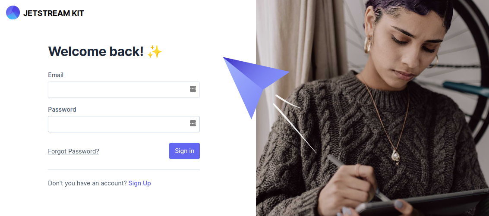
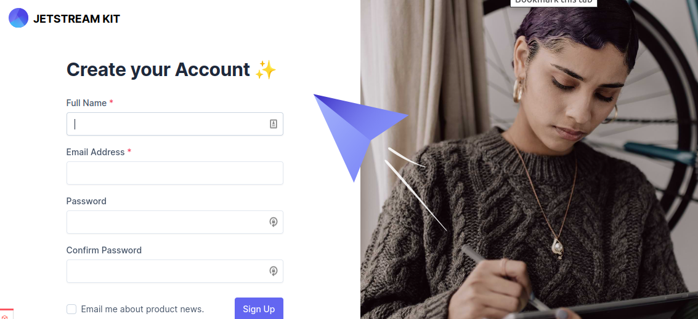
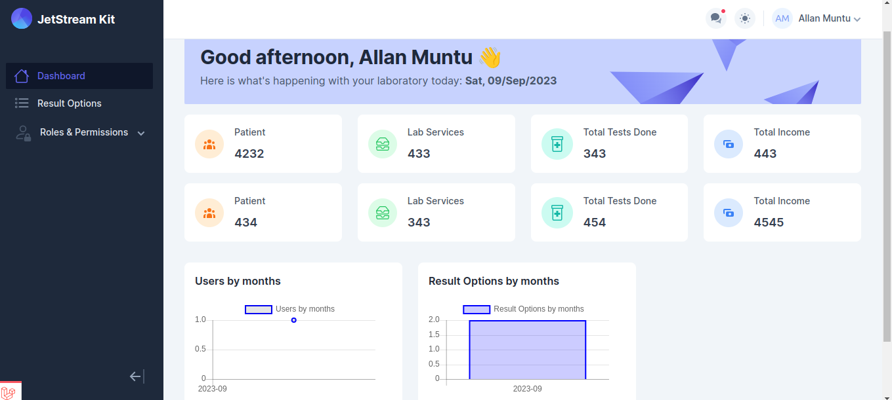

# Laravel jetstream starter kit

### Requirements
 
 - PHP ^8.2
 - Laravel ^11

### What is included
 - Livewire ^3.0
 - Tailwind ^3.4

### Installation
1. Clone the repo and `cd` into it.
2. Run composer install 
3. Copy `.env.example` to `env`
4. Run `php artisan key:generate`
5. Set your database credentials in your `.env` file and run `php artisan migrate:seed`
6. Run `npm install && npm run dev` 
7. Finally run `php artisan serve`

### or you can run all the steps in just on step.

`git clone https://github.com/Williamug/laravel-jetstream-starter-kit.git project_name && cd project_name && composer install && cp .env.example .env && php artisan key:generate && touch database/database.sqlite && php artisan migrate --seed && npm install && code .`

The command above will clone the repo and `cd` to your project, run `composer install`, run `cp .env.example .env`, generate the `APP_KEY`, create sqlite database file, migrate database and seed the database, install npm packages and open the project in `vs code`.
# Note.
Change **project_name** to whatever you want to call your project

## Note
Recommend to install this kit on a fresh project otherwise your project might break.

If you found this project usefull, then please consider giving it a ⭐

#### Sample images
Login

Sign Up

Dashboard

Table

# License
Licensed under the [MIT](LICENSE) license

